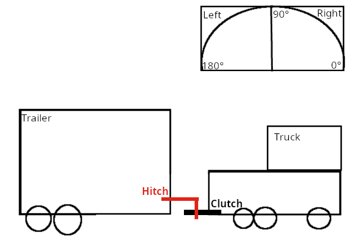

## Autonomer LKW
Einzelleistung Komplexaufgabe
```code
Jahrgang:        TINF22A
Matrikelnummer:  XXX
```

## Sketch



## Fortschritt

| Patterns     | Code |
|--------------|------|
| Builder 1+2  | 100% |
| Mediator 1+2 | 50%  |
| Command      | 100% |
| Composite    | 90%  |
| State        | 100% |
| Observer     | 100% |

| Tests | Check |
|-------|-------|
| 1     | ok    |
| 2     | ok    |
| 3     | ok    |
| 4     | ok    |

## Anmerkungen