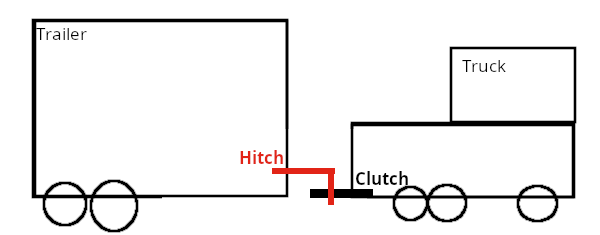

## Autonomer LKW
Einzelleistung Komplexaufgabe
```code
Jahrgang:        TINF22A
Matrikelnummer:  XXX
```

## Sketch



## Fortschritt

| Pattern      | Code | Test |
|--------------|------|------|
| Builder 1+2  | 100% | 100% |
| Mediator 1+2 | 50%  | -    |
| Command      | 90%  | 0%   |
| Composite    | 90%  | 0%   |
| State        | 50%  | 0%   |
| Observer     | 70%  | 0%   |

## Anmerkungen